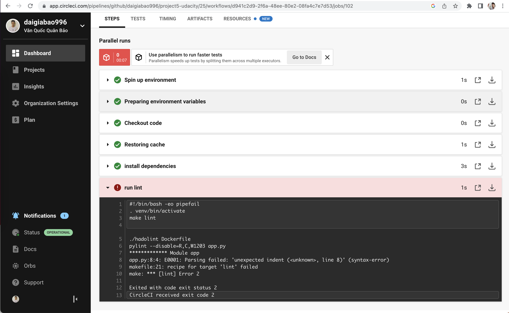

# Cloud DevOps Engineer Capstone Project

This project represents the successful completion of the last final Capstone project and the Cloud DevOps Engineer Nanodegree at Udacity.
- Github: https://github.com/daigiabao996/project5-udacity
- Docker: hhttps://hub.docker.com/repository/docker/emb1605272/capstone-project
- CircleCI: [](https://app.circleci.com/pipelines/github/daigiabao996/project5-udacity)
## What did I learn?

In this project, I applied the skills and knowledge I developed throughout the Cloud DevOps Nanodegree program. These include:
- Using Circle CI to implement Continuous Integration and Continuous Deployment
- Building pipelines
- Working with Ansible and CloudFormation to deploy clusters
- Building Kubernetes clusters
- Building Docker containers in pipelines
- Working in AWS

## Application

The Application is based on a python3 script using <a target="_blank" href="https://flask.palletsprojects.com">flask</a> to render a simple webpage in the user's browser (and base on project 4).
A requirements.txt is used to ensure that all needed dependencies come along with the Application.

## Kubernetes Cluster

I used AWS CloudFormation to deploy the Kubernetes Cluster.
The CloudFormation Deployment can be broken down into four Parts:
- **Networking**, to ensure new nodes can communicate with the Cluster
- **Elastic Kubernetes Service (EKS)** is used to create a Kubernetes Cluster
- **NodeGroup**, each NodeGroup has a set of rules to define how instances are operated and created for the EKS-Cluster
- **Toggle** is needed to configure and manage the Cluster and its deployments and services. I created two management hosts for extra redundancy if one of them fails.

#### List of deployed Stacks:


#### List of deployed Instances:


## CircleCi - CI/CD Pipelines

I used CircleCi to create a CI/CD Pipeline to test and deploy changes manually before they get deployed automatically to the Cluster using Ansible.

#### From Zero to Hero demonstration:


## Linting using Pylint and Hadolint

Linting is used to check if the Application and Dockerfile is syntactically correct.
This process makes sure that the code quality is always as good as possible.

#### This is the output when the step fails:




#### This is the output when the step passes:


## Upload Docker Image After Successful Build


## Access the Application

After the EKS-Cluster has been successfully configured using Ansible within the CI/CD Pipeline, I checked the deployment and service log on pipeline as follows:

```
    ##TASK [Get deployment] **********************************************************
    changed: [54.227.124.8] => {
        "changed": true,
        "cmd": "./bin/kubectl get deployments",
        "delta": "0:00:00.920119",
        "end": "2022-11-28 10:07:44.404594",
        "invocation": {
            "module_args": {
                "_raw_params": "./bin/kubectl get deployments",
                "_uses_shell": true,
                "argv": null,
                "chdir": "/root",
                "creates": null,
                "executable": null,
                "removes": null,
                "stdin": null,
                "stdin_add_newline": true,
                "strip_empty_ends": true,
                "warn": false
            }
        },
        "msg": "",
        "rc": 0,
        "start": "2022-11-28 10:07:43.484475",
        "stderr": "",
        "stderr_lines": [],
        "stdout": "NAME                          READY   UP-TO-DATE   AVAILABLE   AGE\n****************-deployment   2/2     2            2           125m",
        "stdout_lines": [
            "NAME                          READY   UP-TO-DATE   AVAILABLE   AGE",
            "****************-deployment   2/2     2            2           125m"
        ]
    }

    ##TASK [Get service] *************************************************************
    
262
263
264
265
266
267
268
269
#!/bin/bash -eo pipefail
cat ~/inventory.txt            
cd ansible
ansible-playbook -i ~/inventory.txt deploy-app.yml -vvv

[switch]
54.227.124.8
100.24.68.30
ansible-playbook [core 2.12.10]
  config file = /home/circleci/project/ansible/ansible.cfg
  configured module search path = ['/home/circleci/.ansible/plugins/modules', '/usr/share/ansible/plugins/modules']
  ansible python module location = /usr/lib/python3/dist-packages/ansible
  ansible collection location = /home/circleci/.ansible/collections:/usr/share/ansible/collections
  executable location = /usr/bin/ansible-playbook
  python version = 3.8.10 (default, Jun 22 2022, 20:18:18) [GCC 9.4.0]
  jinja version = 2.10.1
  libyaml = True
Using /home/circleci/project/ansible/ansible.cfg as config file
host_list declined parsing /home/circleci/inventory.txt as it did not pass its verify_file() method
script declined parsing /home/circleci/inventory.txt as it did not pass its verify_file() method
auto declined parsing /home/circleci/inventory.txt as it did not pass its verify_file() method
yaml declined parsing /home/circleci/inventory.txt as it did not pass its verify_file() method
Parsed /home/circleci/inventory.txt inventory source with ini plugin
Skipping callback 'default', as we already have a stdout callback.
Skipping callback 'minimal', as we already have a stdout callback.
Skipping callback 'oneline', as we already have a stdout callback.

PLAYBOOK: deploy-app.yml *******************************************************
1 plays in deploy-app.yml

PLAY [Deploy latest app] *******************************************************
META: ran handlers

TASK [Update the deployment to run the latest Build] ***************************
task path: /home/circleci/project/ansible/deploy-app.yml:10
<54.227.124.8> ESTABLISH SSH CONNECTION FOR USER: ubuntu
<54.227.124.8> SSH: EXEC ssh -C -o ControlMaster=auto -o ControlPersist=60s -o StrictHostKeyChecking=no -o KbdInteractiveAuthentication=no -o PreferredAuthentications=gssapi-with-mic,gssapi-keyex,hostbased,publickey -o PasswordAuthentication=no -o 'User="ubuntu"' -o ConnectTimeout=10 -o 'ControlPath="/home/circleci/.ansible/cp/d891129233"' 54.227.124.8 '/bin/sh -c '"'"'echo ~ubuntu && sleep 0'"'"''
<54.227.124.8> (0, b'/home/ubuntu\n', b"Warning: Permanently added '54.227.124.8' (ECDSA) to the list of known hosts.\r\n")
<54.227.124.8> ESTABLISH SSH CONNECTION FOR USER: ubuntu
<54.227.124.8> SSH: EXEC ssh -C -o ControlMaster=auto -o ControlPersist=60s -o StrictHostKeyChecking=no -o KbdInteractiveAuthentication=no -o PreferredAuthentications=gssapi-with-mic,gssapi-keyex,hostbased,publickey -o PasswordAuthentication=no -o 'User="ubuntu"' -o ConnectTimeout=10 -o 'ControlPath="/home/circleci/.ansible/cp/d891129233"' 54.227.124.8 '/bin/sh -c '"'"'( umask 77 && mkdir -p "` echo /home/ubuntu/.ansible/tmp `"&& mkdir "` echo /home/ubuntu/.ansible/tmp/ansible-tmp-1669630055.4861653-1458-200007033813248 `" && echo ansible-tmp-1669630055.4861653-1458-200007033813248="` echo /home/ubuntu/.ansible/tmp/ansible-tmp-1669630055.4861653-1458-200007033813248 `" ) && sleep 0'"'"''
<54.227.124.8> (0, b'ansible-tmp-1669630055.4861653-1458-200007033813248=/home/ubuntu/.ansible/tmp/ansible-tmp-1669630055.4861653-1458-200007033813248\n', b'')
<54.227.124.8> Attempting python interpreter discovery
<54.227.124.8> ESTABLISH SSH CONNECTION FOR USER: ubuntu
<54.227.124.8> SSH: EXEC ssh -C -o ControlMaster=auto -o ControlPersist=60s -o StrictHostKeyChecking=no -o KbdInteractiveAuthentication=no -o PreferredAuthentications=gssapi-with-mic,gssapi-keyex,hostbased,publickey -o PasswordAuthentication=no -o 'User="ubuntu"' -o ConnectTimeout=10 -o 'ControlPath="/home/circleci/.ansible/cp/d891129233"' 54.227.124.8 '/bin/sh -c '"'"'echo PLATFORM; uname; echo FOUND; command -v '"'"'"'"'"'"'"'"'python3.10'"'"'"'"'"'"'"'"'; command -v '"'"'"'"'"'"'"'"'python3.9'"'"'"'"'"'"'"'"'; command -v '"'"'"'"'"'"'"'"'python3.8'"'"'"'"'"'"'"'"'; command -v '"'"'"'"'"'"'"'"'python3.7'"'"'"'"'"'"'"'"'; command -v '"'"'"'"'"'"'"'"'python3.6'"'"'"'"'"'"'"'"'; command -v '"'"'"'"'"'"'"'"'python3.5'"'"'"'"'"'"'"'"'; command -v '"'"'"'"'"'"'"'"'/usr/bin/python3'"'"'"'"'"'"'"'"'; command -v '"'"'"'"'"'"'"'"'/usr/libexec/platform-python'"'"'"'"'"'"'"'"'; command -v '"'"'"'"'"'"'"'"'python2.7'"'"'"'"'"'"'"'"'; command -v '"'"'"'"'"'"'"'"'python2.6'"'"'"'"'"'"'"'"'; command -v '"'"'"'"'"'"'"'"'/usr/bin/python'"'"'"'"'"'"'"'"'; command -v '"'"'"'"'"'"'"'"'python'"'"'"'"'"'"'"'"'; echo ENDFOUND && sleep 0'"'"''
<54.227.124.8> (0, b'PLATFORM\nLinux\nFOUND\n/usr/bin/python3.8\n/usr/bin/python3\nENDFOUND\n', b'')
<54.227.124.8> ESTABLISH SSH CONNECTION FOR USER: ubuntu
<54.227.124.8> SSH: EXEC ssh -C -o ControlMaster=auto -o ControlPersist=60s -o StrictHostKeyChecking=no -o KbdInteractiveAuthentication=no -o PreferredAuthentications=gssapi-with-mic,gssapi-keyex,hostbased,publickey -o PasswordAuthentication=no -o 'User="ubuntu"' -o ConnectTimeout=10 -o 'ControlPath="/home/circleci/.ansible/cp/d891129233"' 54.227.124.8 '/bin/sh -c '"'"'/usr/bin/python3.8 && sleep 0'"'"''
<54.227.124.8> (0, b'{"platform_dist_result": [], "osrelease_content": "NAME=\\"Ubuntu\\"\\nVERSION=\\"20.04 LTS (Focal Fossa)\\"\\nID=ubuntu\\nID_LIKE=debian\\nPRETTY_NAME=\\"Ubuntu 20.04 LTS\\"\\nVERSION_ID=\\"20.04\\"\\nHOME_URL=\\"https://www.ubuntu.com/\\"\\nSUPPORT_URL=\\"https://help.ubuntu.com/\\"\\nBUG_REPORT_URL=\\"https://bugs.launchpad.net/ubuntu/\\"\\nPRIVACY_POLICY_URL=\\"https://www.ubuntu.com/legal/terms-and-policies/privacy-policy\\"\\nVERSION_CODENAME=focal\\nUBUNTU_CODENAME=focal\\n"}\n', b'')
Using module file /usr/lib/python3/dist-packages/ansible/modules/command.py
<54.227.124.8> PUT /home/circleci/.ansible/tmp/ansible-local-1452af7a5i0f/tmp3br7a6vb TO /home/ubuntu/.ansible/tmp/ansible-tmp-1669630055.4861653-1458-200007033813248/AnsiballZ_command.py
<54.227.124.8> SSH: EXEC sftp -b - -C -o ControlMaster=auto -o ControlPersist=60s -o StrictHostKeyChecking=no -o KbdInteractiveAuthentication=no -o PreferredAuthentications=gssapi-with-mic,gssapi-keyex,hostbased,publickey -o PasswordAuthentication=no -o 'User="ubuntu"' -o ConnectTimeout=10 -o 'ControlPath="/home/circleci/.ansible/cp/d891129233"' '[54.227.124.8]'
<54.227.124.8> (0, b'sftp> put /home/circleci/.ansible/tmp/ansible-local-1452af7a5i0f/tmp3br7a6vb /home/ubuntu/.ansible/tmp/ansible-tmp-1669630055.4861653-1458-200007033813248/AnsiballZ_command.py\n', b'')
<54.227.124.8> ESTABLISH SSH CONNECTION FOR USER: ubuntu
<54.227.124.8> SSH: EXEC ssh -C -o ControlMaster=auto -o ControlPersist=60s -o StrictHostKeyChecking=no -o KbdInteractiveAuthentication=no -o PreferredAuthentications=gssapi-with-mic,gssapi-keyex,hostbased,publickey -o PasswordAuthentication=no -o 'User="ubuntu"' -o ConnectTimeout=10 -o 'ControlPath="/home/circleci/.ansible/cp/d891129233"' 54.227.124.8 '/bin/sh -c '"'"'chmod u+x /home/ubuntu/.ansible/tmp/ansible-tmp-1669630055.4861653-1458-200007033813248/ /home/ubuntu/.ansible/tmp/ansible-tmp-1669630055.4861653-1458-200007033813248/AnsiballZ_command.py && sleep 0'"'"''
<54.227.124.8> (0, b'', b'')
<54.227.124.8> ESTABLISH SSH CONNECTION FOR USER: ubuntu
<54.227.124.8> SSH: EXEC ssh -C -o ControlMaster=auto -o ControlPersist=60s -o StrictHostKeyChecking=no -o KbdInteractiveAuthentication=no -o PreferredAuthentications=gssapi-with-mic,gssapi-keyex,hostbased,publickey -o PasswordAuthentication=no -o 'User="ubuntu"' -o ConnectTimeout=10 -o 'ControlPath="/home/circleci/.ansible/cp/d891129233"' -tt 54.227.124.8 '/bin/sh -c '"'"'sudo -H -S -n  -u root /bin/sh -c '"'"'"'"'"'"'"'"'echo BECOME-SUCCESS-wmtnwavzzlxvgcaoibidxdxukgdsmglw ; /usr/bin/python3 /home/ubuntu/.ansible/tmp/ansible-tmp-1669630055.4861653-1458-200007033813248/AnsiballZ_command.py'"'"'"'"'"'"'"'"' && sleep 0'"'"''
Escalation succeeded
<54.227.124.8> (0, b'\r\n{"changed": true, "stdout": "deployment.apps/****************-deployment image updated", "stderr": "", "rc": 0, "cmd": "./bin/kubectl set image deployments/****************-deployment ****************-app=******/****************:2da0e633-42bf-4684-816d-ac359173e306", "start": "2022-11-28 10:07:35.860193", "end": "2022-11-28 10:07:36.790603", "delta": "0:00:00.930410", "msg": "", "invocation": {"module_args": {"chdir": "/root", "_raw_params": "./bin/kubectl set image deployments/****************-deployment ****************-app=******/****************:2da0e633-42bf-4684-816d-ac359173e306", "_uses_shell": true, "warn": false, "stdin_add_newline": true, "strip_empty_ends": true, "argv": null, "executable": null, "creates": null, "removes": null, "stdin": null}}}\r\n', b'Shared connection to 54.227.124.8 closed.\r\n')
<54.227.124.8> ESTABLISH SSH CONNECTION FOR USER: ubuntu
<54.227.124.8> SSH: EXEC ssh -C -o ControlMaster=auto -o ControlPersist=60s -o StrictHostKeyChecking=no -o KbdInteractiveAuthentication=no -o PreferredAuthentications=gssapi-with-mic,gssapi-keyex,hostbased,publickey -o PasswordAuthentication=no -o 'User="ubuntu"' -o ConnectTimeout=10 -o 'ControlPath="/home/circleci/.ansible/cp/d891129233"' 54.227.124.8 '/bin/sh -c '"'"'rm -f -r /home/ubuntu/.ansible/tmp/ansible-tmp-1669630055.4861653-1458-200007033813248/ > /dev/null 2>&1 && sleep 0'"'"''
<54.227.124.8> (0, b'', b'')
changed: [54.227.124.8] => {
    "ansible_facts": {
        "discovered_interpreter_python": "/usr/bin/python3"
    },
    "changed": true,
    "cmd": "./bin/kubectl set image deployments/****************-deployment ****************-app=******/****************:2da0e633-42bf-4684-816d-ac359173e306",
    "delta": "0:00:00.930410",
    "end": "2022-11-28 10:07:36.790603",
    "invocation": {
        "module_args": {
            "_raw_params": "./bin/kubectl set image deployments/****************-deployment ****************-app=******/****************:2da0e633-42bf-4684-816d-ac359173e306",
            "_uses_shell": true,
            "argv": null,
            "chdir": "/root",
            "creates": null,
            "executable": null,
            "removes": null,
            "stdin": null,
            "stdin_add_newline": true,
            "strip_empty_ends": true,
            "warn": false
        }
    },
    "msg": "",
    "rc": 0,
    "start": "2022-11-28 10:07:35.860193",
    "stderr": "",
    "stderr_lines": [],
    "stdout": "deployment.apps/****************-deployment image updated",
    "stdout_lines": [
        "deployment.apps/****************-deployment image updated"
    ]
}

TASK [Check if deployment is successful] ***************************************
task path: /home/circleci/project/ansible/deploy-app.yml:15
<54.227.124.8> ESTABLISH SSH CONNECTION FOR USER: ubuntu
<54.227.124.8> SSH: EXEC ssh -C -o ControlMaster=auto -o ControlPersist=60s -o StrictHostKeyChecking=no -o KbdInteractiveAuthentication=no -o PreferredAuthentications=gssapi-with-mic,gssapi-keyex,hostbased,publickey -o PasswordAuthentication=no -o 'User="ubuntu"' -o ConnectTimeout=10 -o 'ControlPath="/home/circleci/.ansible/cp/d891129233"' 54.227.124.8 '/bin/sh -c '"'"'echo ~ubuntu && sleep 0'"'"''
<54.227.124.8> (0, b'/home/ubuntu\n', b'')
<54.227.124.8> ESTABLISH SSH CONNECTION FOR USER: ubuntu
<54.227.124.8> SSH: EXEC ssh -C -o ControlMaster=auto -o ControlPersist=60s -o StrictHostKeyChecking=no -o KbdInteractiveAuthentication=no -o PreferredAuthentications=gssapi-with-mic,gssapi-keyex,hostbased,publickey -o PasswordAuthentication=no -o 'User="ubuntu"' -o ConnectTimeout=10 -o 'ControlPath="/home/circleci/.ansible/cp/d891129233"' 54.227.124.8 '/bin/sh -c '"'"'( umask 77 && mkdir -p "` echo /home/ubuntu/.ansible/tmp `"&& mkdir "` echo /home/ubuntu/.ansible/tmp/ansible-tmp-1669630056.8669384-1472-90101359061015 `" && echo ansible-tmp-1669630056.8669384-1472-90101359061015="` echo /home/ubuntu/.ansible/tmp/ansible-tmp-1669630056.8669384-1472-90101359061015 `" ) && sleep 0'"'"''
<54.227.124.8> (0, b'ansible-tmp-1669630056.8669384-1472-90101359061015=/home/ubuntu/.ansible/tmp/ansible-tmp-1669630056.8669384-1472-90101359061015\n', b'')
Using module file /usr/lib/python3/dist-packages/ansible/modules/command.py
<54.227.124.8> PUT /home/circleci/.ansible/tmp/ansible-local-1452af7a5i0f/tmphrvpe9ei TO /home/ubuntu/.ansible/tmp/ansible-tmp-1669630056.8669384-1472-90101359061015/AnsiballZ_command.py
<54.227.124.8> SSH: EXEC sftp -b - -C -o ControlMaster=auto -o ControlPersist=60s -o StrictHostKeyChecking=no -o KbdInteractiveAuthentication=no -o PreferredAuthentications=gssapi-with-mic,gssapi-keyex,hostbased,publickey -o PasswordAuthentication=no -o 'User="ubuntu"' -o ConnectTimeout=10 -o 'ControlPath="/home/circleci/.ansible/cp/d891129233"' '[54.227.124.8]'
<54.227.124.8> (0, b'sftp> put /home/circleci/.ansible/tmp/ansible-local-1452af7a5i0f/tmphrvpe9ei /home/ubuntu/.ansible/tmp/ansible-tmp-1669630056.8669384-1472-90101359061015/AnsiballZ_command.py\n', b'')
<54.227.124.8> ESTABLISH SSH CONNECTION FOR USER: ubuntu
<54.227.124.8> SSH: EXEC ssh -C -o ControlMaster=auto -o ControlPersist=60s -o StrictHostKeyChecking=no -o KbdInteractiveAuthentication=no -o PreferredAuthentications=gssapi-with-mic,gssapi-keyex,hostbased,publickey -o PasswordAuthentication=no -o 'User="ubuntu"' -o ConnectTimeout=10 -o 'ControlPath="/home/circleci/.ansible/cp/d891129233"' 54.227.124.8 '/bin/sh -c '"'"'chmod u+x /home/ubuntu/.ansible/tmp/ansible-tmp-1669630056.8669384-1472-90101359061015/ /home/ubuntu/.ansible/tmp/ansible-tmp-1669630056.8669384-1472-90101359061015/AnsiballZ_command.py && sleep 0'"'"''
<54.227.124.8> (0, b'', b'')
<54.227.124.8> ESTABLISH SSH CONNECTION FOR USER: ubuntu
<54.227.124.8> SSH: EXEC ssh -C -o ControlMaster=auto -o ControlPersist=60s -o StrictHostKeyChecking=no -o KbdInteractiveAuthentication=no -o PreferredAuthentications=gssapi-with-mic,gssapi-keyex,hostbased,publickey -o PasswordAuthentication=no -o 'User="ubuntu"' -o ConnectTimeout=10 -o 'ControlPath="/home/circleci/.ansible/cp/d891129233"' -tt 54.227.124.8 '/bin/sh -c '"'"'sudo -H -S -n  -u root /bin/sh -c '"'"'"'"'"'"'"'"'echo BECOME-SUCCESS-xdtbfqnuxiooxcjgunyhjiohzmrirppc ; /usr/bin/python3 /home/ubuntu/.ansible/tmp/ansible-tmp-1669630056.8669384-1472-90101359061015/AnsiballZ_command.py'"'"'"'"'"'"'"'"' && sleep 0'"'"''
Escalation succeeded
<54.227.124.8> (0, b'\r\n{"changed": true, "stdout": "Waiting for deployment \\"****************-deployment\\" rollout to finish: 1 out of 2 new replicas have been updated...\\nWaiting for deployment \\"****************-deployment\\" rollout to finish: 1 out of 2 new replicas have been updated...\\nWaiting for deployment \\"****************-deployment\\" rollout to finish: 1 out of 2 new replicas have been updated...\\nWaiting for deployment \\"****************-deployment\\" rollout to finish: 1 old replicas are pending termination...\\nWaiting for deployment \\"****************-deployment\\" rollout to finish: 1 old replicas are pending termination...\\ndeployment \\"****************-deployment\\" successfully rolled out", "stderr": "", "rc": 0, "cmd": "./bin/kubectl rollout status deployments/****************-deployment", "start": "2022-11-28 10:07:37.067521", "end": "2022-11-28 10:07:43.210867", "delta": "0:00:06.143346", "msg": "", "invocation": {"module_args": {"chdir": "/root", "_raw_params": "./bin/kubectl rollout status deployments/****************-deployment", "_uses_shell": true, "warn": false, "stdin_add_newline": true, "strip_empty_ends": true, "argv": null, "executable": null, "creates": null, "removes": null, "stdin": null}}}\r\n', b'Shared connection to 54.227.124.8 closed.\r\n')
<54.227.124.8> ESTABLISH SSH CONNECTION FOR USER: ubuntu
<54.227.124.8> SSH: EXEC ssh -C -o ControlMaster=auto -o ControlPersist=60s -o StrictHostKeyChecking=no -o KbdInteractiveAuthentication=no -o PreferredAuthentications=gssapi-with-mic,gssapi-keyex,hostbased,publickey -o PasswordAuthentication=no -o 'User="ubuntu"' -o ConnectTimeout=10 -o 'ControlPath="/home/circleci/.ansible/cp/d891129233"' 54.227.124.8 '/bin/sh -c '"'"'rm -f -r /home/ubuntu/.ansible/tmp/ansible-tmp-1669630056.8669384-1472-90101359061015/ > /dev/null 2>&1 && sleep 0'"'"''
<54.227.124.8> (0, b'', b'')
changed: [54.227.124.8] => {
    "changed": true,
    "cmd": "./bin/kubectl rollout status deployments/****************-deployment",
    "delta": "0:00:06.143346",
    "end": "2022-11-28 10:07:43.210867",
    "invocation": {
        "module_args": {
            "_raw_params": "./bin/kubectl rollout status deployments/****************-deployment",
            "_uses_shell": true,
            "argv": null,
            "chdir": "/root",
            "creates": null,
            "executable": null,
            "removes": null,
            "stdin": null,
            "stdin_add_newline": true,
            "strip_empty_ends": true,
            "warn": false
        }
    },
    "msg": "",
    "rc": 0,
    "start": "2022-11-28 10:07:37.067521",
    "stderr": "",
    "stderr_lines": [],
    "stdout": "Waiting for deployment \"****************-deployment\" rollout to finish: 1 out of 2 new replicas have been updated...\nWaiting for deployment \"****************-deployment\" rollout to finish: 1 out of 2 new replicas have been updated...\nWaiting for deployment \"****************-deployment\" rollout to finish: 1 out of 2 new replicas have been updated...\nWaiting for deployment \"****************-deployment\" rollout to finish: 1 old replicas are pending termination...\nWaiting for deployment \"****************-deployment\" rollout to finish: 1 old replicas are pending termination...\ndeployment \"****************-deployment\" successfully rolled out",
    "stdout_lines": [
        "Waiting for deployment \"****************-deployment\" rollout to finish: 1 out of 2 new replicas have been updated...",
        "Waiting for deployment \"****************-deployment\" rollout to finish: 1 out of 2 new replicas have been updated...",
        "Waiting for deployment \"****************-deployment\" rollout to finish: 1 out of 2 new replicas have been updated...",
        "Waiting for deployment \"****************-deployment\" rollout to finish: 1 old replicas are pending termination...",
        "Waiting for deployment \"****************-deployment\" rollout to finish: 1 old replicas are pending termination...",
        "deployment \"****************-deployment\" successfully rolled out"
    ]
}

TASK [Get deployment] **********************************************************
task path: /home/circleci/project/ansible/deploy-app.yml:20
<54.227.124.8> ESTABLISH SSH CONNECTION FOR USER: ubuntu
<54.227.124.8> SSH: EXEC ssh -C -o ControlMaster=auto -o ControlPersist=60s -o StrictHostKeyChecking=no -o KbdInteractiveAuthentication=no -o PreferredAuthentications=gssapi-with-mic,gssapi-keyex,hostbased,publickey -o PasswordAuthentication=no -o 'User="ubuntu"' -o ConnectTimeout=10 -o 'ControlPath="/home/circleci/.ansible/cp/d891129233"' 54.227.124.8 '/bin/sh -c '"'"'echo ~ubuntu && sleep 0'"'"''
<54.227.124.8> (0, b'/home/ubuntu\n', b'')
<54.227.124.8> ESTABLISH SSH CONNECTION FOR USER: ubuntu
<54.227.124.8> SSH: EXEC ssh -C -o ControlMaster=auto -o ControlPersist=60s -o StrictHostKeyChecking=no -o KbdInteractiveAuthentication=no -o PreferredAuthentications=gssapi-with-mic,gssapi-keyex,hostbased,publickey -o PasswordAuthentication=no -o 'User="ubuntu"' -o ConnectTimeout=10 -o 'ControlPath="/home/circleci/.ansible/cp/d891129233"' 54.227.124.8 '/bin/sh -c '"'"'( umask 77 && mkdir -p "` echo /home/ubuntu/.ansible/tmp `"&& mkdir "` echo /home/ubuntu/.ansible/tmp/ansible-tmp-1669630063.2840137-1481-233504561090161 `" && echo ansible-tmp-1669630063.2840137-1481-233504561090161="` echo /home/ubuntu/.ansible/tmp/ansible-tmp-1669630063.2840137-1481-233504561090161 `" ) && sleep 0'"'"''
<54.227.124.8> (0, b'ansible-tmp-1669630063.2840137-1481-233504561090161=/home/ubuntu/.ansible/tmp/ansible-tmp-1669630063.2840137-1481-233504561090161\n', b'')
Using module file /usr/lib/python3/dist-packages/ansible/modules/command.py
<54.227.124.8> PUT /home/circleci/.ansible/tmp/ansible-local-1452af7a5i0f/tmpz0r8yzq0 TO /home/ubuntu/.ansible/tmp/ansible-tmp-1669630063.2840137-1481-233504561090161/AnsiballZ_command.py
<54.227.124.8> SSH: EXEC sftp -b - -C -o ControlMaster=auto -o ControlPersist=60s -o StrictHostKeyChecking=no -o KbdInteractiveAuthentication=no -o PreferredAuthentications=gssapi-with-mic,gssapi-keyex,hostbased,publickey -o PasswordAuthentication=no -o 'User="ubuntu"' -o ConnectTimeout=10 -o 'ControlPath="/home/circleci/.ansible/cp/d891129233"' '[54.227.124.8]'
<54.227.124.8> (0, b'sftp> put /home/circleci/.ansible/tmp/ansible-local-1452af7a5i0f/tmpz0r8yzq0 /home/ubuntu/.ansible/tmp/ansible-tmp-1669630063.2840137-1481-233504561090161/AnsiballZ_command.py\n', b'')
<54.227.124.8> ESTABLISH SSH CONNECTION FOR USER: ubuntu
<54.227.124.8> SSH: EXEC ssh -C -o ControlMaster=auto -o ControlPersist=60s -o StrictHostKeyChecking=no -o KbdInteractiveAuthentication=no -o PreferredAuthentications=gssapi-with-mic,gssapi-keyex,hostbased,publickey -o PasswordAuthentication=no -o 'User="ubuntu"' -o ConnectTimeout=10 -o 'ControlPath="/home/circleci/.ansible/cp/d891129233"' 54.227.124.8 '/bin/sh -c '"'"'chmod u+x /home/ubuntu/.ansible/tmp/ansible-tmp-1669630063.2840137-1481-233504561090161/ /home/ubuntu/.ansible/tmp/ansible-tmp-1669630063.2840137-1481-233504561090161/AnsiballZ_command.py && sleep 0'"'"''
<54.227.124.8> (0, b'', b'')
<54.227.124.8> ESTABLISH SSH CONNECTION FOR USER: ubuntu
<54.227.124.8> SSH: EXEC ssh -C -o ControlMaster=auto -o ControlPersist=60s -o StrictHostKeyChecking=no -o KbdInteractiveAuthentication=no -o PreferredAuthentications=gssapi-with-mic,gssapi-keyex,hostbased,publickey -o PasswordAuthentication=no -o 'User="ubuntu"' -o ConnectTimeout=10 -o 'ControlPath="/home/circleci/.ansible/cp/d891129233"' -tt 54.227.124.8 '/bin/sh -c '"'"'sudo -H -S -n  -u root /bin/sh -c '"'"'"'"'"'"'"'"'echo BECOME-SUCCESS-stbniovlinerqxyphmkqxyghhbjtaweg ; /usr/bin/python3 /home/ubuntu/.ansible/tmp/ansible-tmp-1669630063.2840137-1481-233504561090161/AnsiballZ_command.py'"'"'"'"'"'"'"'"' && sleep 0'"'"''
Escalation succeeded
<54.227.124.8> (0, b'\r\n{"changed": true, "stdout": "NAME                          READY   UP-TO-DATE   AVAILABLE   AGE\\n****************-deployment   2/2     2            2           125m", "stderr": "", "rc": 0, "cmd": "./bin/kubectl get deployments", "start": "2022-11-28 10:07:43.484475", "end": "2022-11-28 10:07:44.404594", "delta": "0:00:00.920119", "msg": "", "invocation": {"module_args": {"chdir": "/root", "_raw_params": "./bin/kubectl get deployments", "_uses_shell": true, "warn": false, "stdin_add_newline": true, "strip_empty_ends": true, "argv": null, "executable": null, "creates": null, "removes": null, "stdin": null}}}\r\n', b'Shared connection to 54.227.124.8 closed.\r\n')
<54.227.124.8> ESTABLISH SSH CONNECTION FOR USER: ubuntu
<54.227.124.8> SSH: EXEC ssh -C -o ControlMaster=auto -o ControlPersist=60s -o StrictHostKeyChecking=no -o KbdInteractiveAuthentication=no -o PreferredAuthentications=gssapi-with-mic,gssapi-keyex,hostbased,publickey -o PasswordAuthentication=no -o 'User="ubuntu"' -o ConnectTimeout=10 -o 'ControlPath="/home/circleci/.ansible/cp/d891129233"' 54.227.124.8 '/bin/sh -c '"'"'rm -f -r /home/ubuntu/.ansible/tmp/ansible-tmp-1669630063.2840137-1481-233504561090161/ > /dev/null 2>&1 && sleep 0'"'"''
<54.227.124.8> (0, b'', b'')
changed: [54.227.124.8] => {
    "changed": true,
    "cmd": "./bin/kubectl get deployments",
    "delta": "0:00:00.920119",
    "end": "2022-11-28 10:07:44.404594",
    "invocation": {
        "module_args": {
            "_raw_params": "./bin/kubectl get deployments",
            "_uses_shell": true,
            "argv": null,
            "chdir": "/root",
            "creates": null,
            "executable": null,
            "removes": null,
            "stdin": null,
            "stdin_add_newline": true,
            "strip_empty_ends": true,
            "warn": false
        }
    },
    "msg": "",
    "rc": 0,
    "start": "2022-11-28 10:07:43.484475",
    "stderr": "",
    "stderr_lines": [],
    "stdout": "NAME                          READY   UP-TO-DATE   AVAILABLE   AGE\n****************-deployment   2/2     2            2           125m",
    "stdout_lines": [
        "NAME                          READY   UP-TO-DATE   AVAILABLE   AGE",
        "****************-deployment   2/2     2            2           125m"
    ]
}

TASK [Get service] *************************************************************
task path: /home/circleci/project/ansible/deploy-app.yml:25
<54.227.124.8> ESTABLISH SSH CONNECTION FOR USER: ubuntu
<54.227.124.8> SSH: EXEC ssh -C -o ControlMaster=auto -o ControlPersist=60s -o StrictHostKeyChecking=no -o KbdInteractiveAuthentication=no -o PreferredAuthentications=gssapi-with-mic,gssapi-keyex,hostbased,publickey -o PasswordAuthentication=no -o 'User="ubuntu"' -o ConnectTimeout=10 -o 'ControlPath="/home/circleci/.ansible/cp/d891129233"' 54.227.124.8 '/bin/sh -c '"'"'echo ~ubuntu && sleep 0'"'"''
<54.227.124.8> (0, b'/home/ubuntu\n', b'')
<54.227.124.8> ESTABLISH SSH CONNECTION FOR USER: ubuntu
<54.227.124.8> SSH: EXEC ssh -C -o ControlMaster=auto -o ControlPersist=60s -o StrictHostKeyChecking=no -o KbdInteractiveAuthentication=no -o PreferredAuthentications=gssapi-with-mic,gssapi-keyex,hostbased,publickey -o PasswordAuthentication=no -o 'User="ubuntu"' -o ConnectTimeout=10 -o 'ControlPath="/home/circleci/.ansible/cp/d891129233"' 54.227.124.8 '/bin/sh -c '"'"'( umask 77 && mkdir -p "` echo /home/ubuntu/.ansible/tmp `"&& mkdir "` echo /home/ubuntu/.ansible/tmp/ansible-tmp-1669630064.479204-1490-208543412942365 `" && echo ansible-tmp-1669630064.479204-1490-208543412942365="` echo /home/ubuntu/.ansible/tmp/ansible-tmp-1669630064.479204-1490-208543412942365 `" ) && sleep 0'"'"''
<54.227.124.8> (0, b'ansible-tmp-1669630064.479204-1490-208543412942365=/home/ubuntu/.ansible/tmp/ansible-tmp-1669630064.479204-1490-208543412942365\n', b'')
Using module file /usr/lib/python3/dist-packages/ansible/modules/command.py
<54.227.124.8> PUT /home/circleci/.ansible/tmp/ansible-local-1452af7a5i0f/tmpa679782x TO /home/ubuntu/.ansible/tmp/ansible-tmp-1669630064.479204-1490-208543412942365/AnsiballZ_command.py
<54.227.124.8> SSH: EXEC sftp -b - -C -o ControlMaster=auto -o ControlPersist=60s -o StrictHostKeyChecking=no -o KbdInteractiveAuthentication=no -o PreferredAuthentications=gssapi-with-mic,gssapi-keyex,hostbased,publickey -o PasswordAuthentication=no -o 'User="ubuntu"' -o ConnectTimeout=10 -o 'ControlPath="/home/circleci/.ansible/cp/d891129233"' '[54.227.124.8]'
<54.227.124.8> (0, b'sftp> put /home/circleci/.ansible/tmp/ansible-local-1452af7a5i0f/tmpa679782x /home/ubuntu/.ansible/tmp/ansible-tmp-1669630064.479204-1490-208543412942365/AnsiballZ_command.py\n', b'')
<54.227.124.8> ESTABLISH SSH CONNECTION FOR USER: ubuntu
<54.227.124.8> SSH: EXEC ssh -C -o ControlMaster=auto -o ControlPersist=60s -o StrictHostKeyChecking=no -o KbdInteractiveAuthentication=no -o PreferredAuthentications=gssapi-with-mic,gssapi-keyex,hostbased,publickey -o PasswordAuthentication=no -o 'User="ubuntu"' -o ConnectTimeout=10 -o 'ControlPath="/home/circleci/.ansible/cp/d891129233"' 54.227.124.8 '/bin/sh -c '"'"'chmod u+x /home/ubuntu/.ansible/tmp/ansible-tmp-1669630064.479204-1490-208543412942365/ /home/ubuntu/.ansible/tmp/ansible-tmp-1669630064.479204-1490-208543412942365/AnsiballZ_command.py && sleep 0'"'"''
<54.227.124.8> (0, b'', b'')
<54.227.124.8> ESTABLISH SSH CONNECTION FOR USER: ubuntu
<54.227.124.8> SSH: EXEC ssh -C -o ControlMaster=auto -o ControlPersist=60s -o StrictHostKeyChecking=no -o KbdInteractiveAuthentication=no -o PreferredAuthentications=gssapi-with-mic,gssapi-keyex,hostbased,publickey -o PasswordAuthentication=no -o 'User="ubuntu"' -o ConnectTimeout=10 -o 'ControlPath="/home/circleci/.ansible/cp/d891129233"' -tt 54.227.124.8 '/bin/sh -c '"'"'sudo -H -S -n  -u root /bin/sh -c '"'"'"'"'"'"'"'"'echo BECOME-SUCCESS-rxdfacvelncvnrndebzhxfvtepbxkudj ; /usr/bin/python3 /home/ubuntu/.ansible/tmp/ansible-tmp-1669630064.479204-1490-208543412942365/AnsiballZ_command.py'"'"'"'"'"'"'"'"' && sleep 0'"'"''
Escalation succeeded
<54.227.124.8> (0, b'\r\n{"changed": true, "stdout": "NAME                       TYPE           CLUSTER-IP       EXTERNAL-IP                                                             PORT(S)        AGE\\n****************-service   LoadBalancer   10.100.140.191   a6e3d22241f79425eac805cd4a1225a3-19011954.*********.elb.amazonaws.com   80:31706/TCP   88m\\nkubernetes                 ClusterIP      10.100.0.1       <none>                                                                  443/TCP        174m", "stderr": "", "rc": 0, "cmd": "./bin/kubectl get services", "start": "2022-11-28 10:07:44.682873", "end": "2022-11-28 10:07:45.606117", "delta": "0:00:00.923244", "msg": "", "invocation": {"module_args": {"chdir": "/root", "_raw_params": "./bin/kubectl get services", "_uses_shell": true, "warn": false, "stdin_add_newline": true, "strip_empty_ends": true, "argv": null, "executable": null, "creates": null, "removes": null, "stdin": null}}}\r\n', b'Shared connection to 54.227.124.8 closed.\r\n')
<54.227.124.8> ESTABLISH SSH CONNECTION FOR USER: ubuntu
<54.227.124.8> SSH: EXEC ssh -C -o ControlMaster=auto -o ControlPersist=60s -o StrictHostKeyChecking=no -o KbdInteractiveAuthentication=no -o PreferredAuthentications=gssapi-with-mic,gssapi-keyex,hostbased,publickey -o PasswordAuthentication=no -o 'User="ubuntu"' -o ConnectTimeout=10 -o 'ControlPath="/home/circleci/.ansible/cp/d891129233"' 54.227.124.8 '/bin/sh -c '"'"'rm -f -r /home/ubuntu/.ansible/tmp/ansible-tmp-1669630064.479204-1490-208543412942365/ > /dev/null 2>&1 && sleep 0'"'"''
<54.227.124.8> (0, b'', b'')
changed: [54.227.124.8] => {
    "changed": true,
    "cmd": "./bin/kubectl get services",
    "delta": "0:00:00.923244",
    "end": "2022-11-28 10:07:45.606117",
    "invocation": {
        "module_args": {
            "_raw_params": "./bin/kubectl get services",
            "_uses_shell": true,
            "argv": null,
            "chdir": "/root",
            "creates": null,
            "executable": null,
            "removes": null,
            "stdin": null,
            "stdin_add_newline": true,
            "strip_empty_ends": true,
            "warn": false
        }
    },
    "msg": "",
    "rc": 0,
    "start": "2022-11-28 10:07:44.682873",
    "stderr": "",
    "stderr_lines": [],
    "stdout": "NAME                       TYPE           CLUSTER-IP       EXTERNAL-IP                                                             PORT(S)        AGE\n****************-service   LoadBalancer   10.100.140.191   a6e3d22241f79425eac805cd4a1225a3-19011954.*********.elb.amazonaws.com   80:31706/TCP   88m\nkubernetes                 ClusterIP      10.100.0.1       <none>                                                                  443/TCP        174m",
    "stdout_lines": [
        "NAME                       TYPE           CLUSTER-IP       EXTERNAL-IP                                                             PORT(S)        AGE",
        "****************-service   LoadBalancer   10.100.140.191   a6e3d22241f79425eac805cd4a1225a3-19011954.*********.elb.amazonaws.com   80:31706/TCP   88m",
        "kubernetes                 ClusterIP      10.100.0.1       <none>  
    ]
} 
```

Public LB DNS: http://a6e3d22241f79425eac805cd4a1225a3-19011954.us-east-1.elb.amazonaws.com/


